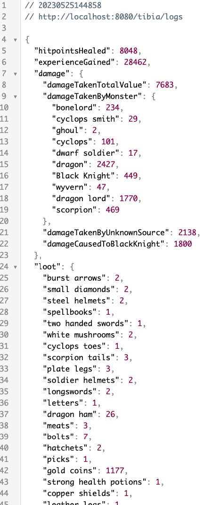

# Tibia Parser Log

This project is a Spring Boot application that utilizes regular expressions (regex) to read and parse Tibia log files. It analyzes the log data to extract various information, including the amount of hitpoints healed, total experience gained by the character, total damage taken, damage taken by monsters, damage taken from unknown sources, and loot items received. The parsed data is exposed as a JSON object through the endpoint: `http://localhost:8080/tibia/logs`.

## Features

- Reading and parsing Tibia log files using regex
- Extracting healing values
- Calculating total experience gained
- Determining total damage taken
- Tracking damage taken by monsters
- Analyzing damage taken from unknown sources
- Recording loot items and their quantities




## Prerequisites

Make sure you have the following installed:

- Java Development Kit (JDK) 11 or higher
- Spring Boot

## Getting Started

1. Clone the repository:

```shell
git clone https://github.com/your-username/tibia-parser-log.git
```

2. Navigate to the project directory:
```shell
cd tibia-parser-log
```

3. Build the project:
```shell
./mvnw clean install
```

4. Run the application:
```shell
./mvnw spring-boot:run
```
The application will start running at http://localhost:8080.

## Usage
1. Prepare your Tibia log file in the appropriate format. (see resources folder)
2. Send a GET request to the following endpoint:
```shell
http://localhost:8080/tibia/logs
```
3. The server will respond with a JSON object containing the parsed log data, including healing values, experience gained, damage taken, damage taken by monsters, damage taken from unknown sources, and loot items received.